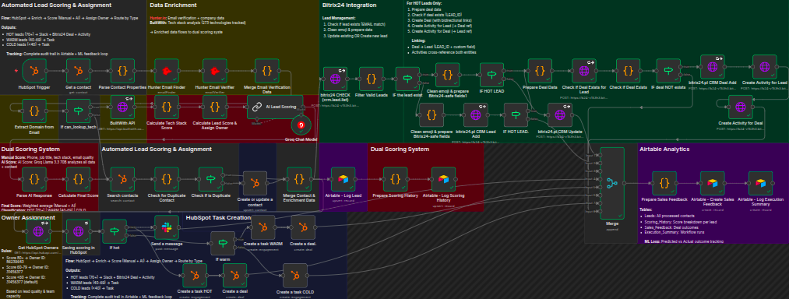
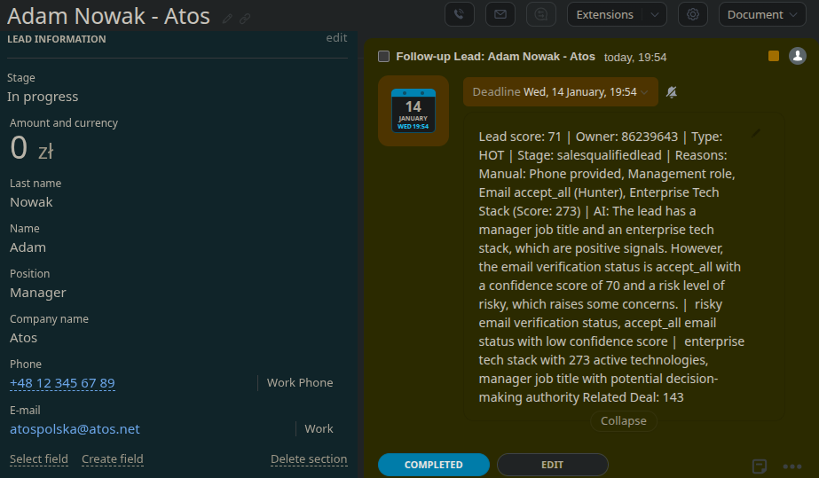
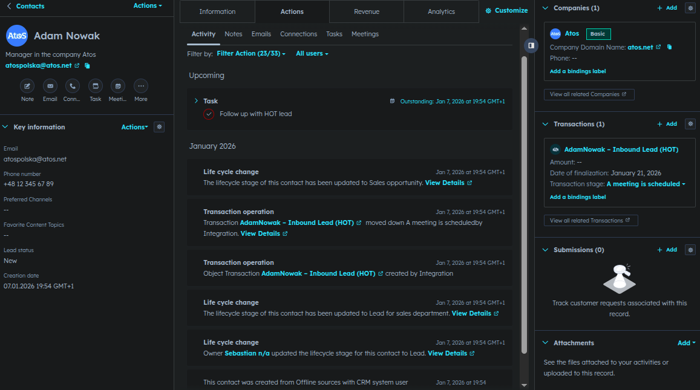

# Hybrid Lead Scoring & CRM Integration System

> **Enterprise n8n workflow** for automated lead qualification with **dual scoring** 
> (Manual + AI), **intelligent routing**, and **multi-CRM synchronization**. 
> Reduces lead processing from **15 minutes to 6 seconds**. 
> Built with Groq Llama 3.3 70B, HubSpot, Bitrix24, and Airtable

[](https://n8n.io)
[](https://hubspot.com)
[](https://bitrix24.com)
[](https://airtable.com)
[](https://groq.com)

---

## Table of Contents

- [Overview](#overview)
- [Key Features](#key-features)
- [System Architecture](#system-architecture)
- [Workflow Components](#workflow-components)
- [Data Flow](#data-flow)
- [Configuration](#configuration)
- [ML Feedback Loop](#ml-feedback-loop)
- [Screenshots](#screenshots)
- [Performance Metrics](#performance-metrics)

---

## Overview

This n8n workflow implements a sophisticated lead scoring and management system that automatically:

- Enriches contact data using Hunter.io and BuiltWith APIs
- Scores leads using both manual criteria and AI (Groq Llama 3.3 70B)
- Routes leads based on quality (HOT/WARM/COLD)
- Creates synchronized records across HubSpot and Bitrix24 CRMs
- Generates actionable tasks with personalized follow-up instructions
- Tracks outcomes for continuous ML-powered optimization

### Business Value

Time Savings: Reduces lead processing from ~15 minutes to ~6 seconds per lead  
Consistency: 100% uniform lead qualification and routing  
Intelligence: AI-powered scoring adapts to your historical conversion data  
Integration: Seamless synchronization across multiple CRM systems  
Optimization: Built-in ML feedback loop for continuous improvement  

---

## Key Features

### Dual Scoring System
- Manual Scoring: Rule-based evaluation using phone, job title, email quality, and tech stack sophistication
- AI Scoring: Groq Llama 3.3 70B analyzes full lead context including company data, tech profile, and conversion patterns
- Weighted Average: Combines both scores for optimal accuracy

### Data Enrichment
- Hunter.io: Email verification, deliverability scoring, and company data
- BuiltWith: Tech stack analysis (273+ technologies tracked)
- Domain Intelligence: Automated company profile building

### Intelligent Routing
- HOT Leads (70+): Slack notification + Bitrix24 Deal + Activity + High-priority task
- WARM Leads (40-69): Medium-priority task with 24h follow-up
- COLD Leads (<40): Low-priority nurture campaign task

### Duplicate Prevention
- Lead-Level: Name matching across Bitrix24 to prevent duplicate lead creation
- Deal-Level: LEAD_ID verification to ensure one deal per lead maximum

### Multi-System Synchronization
- HubSpot: Contact updates, lifecycle stage changes, deal & task creation
- Bitrix24: Lead management, deal creation, activity tracking
- Airtable: Comprehensive logging for analytics and ML training

### ML Feedback Loop
- Tracks predicted vs. actual outcomes
- 30-day review cycle for outcome collection
- Powers continuous model improvement

---

## System Architecture

```
┌─────────────┐
│   HubSpot   │ ← Trigger: New contact created
│   Trigger   │
└──────┬──────┘
       │
       ↓
┌─────────────────────────────────────────────┐
│         DATA ENRICHMENT LAYER               │
├─────────────────────────────────────────────┤
│  • Hunter.io Email Verification            │
│  • BuiltWith Tech Stack Analysis           │
│  • Company Profile Building                 │
└──────┬──────────────────────────────────────┘
       │
       ↓
┌─────────────────────────────────────────────┐
│         DUAL SCORING ENGINE                 │
├─────────────────────────────────────────────┤
│  • Manual Rule-Based Scoring                │
│  • AI-Powered Contextual Scoring (Groq)     │
│  • Weighted Score Calculation               │
│  • HOT/WARM/COLD Classification             │
└──────┬──────────────────────────────────────┘
       │
       ↓
┌─────────────────────────────────────────────┐
│         INTELLIGENT ROUTING                 │
├─────────────────────────────────────────────┤
│  IF Score >= 70 → HOT Path                  │
│  IF Score 40-69 → WARM Path                 │
│  IF Score < 40  → COLD Path                 │
└──────┬──────────────────────────────────────┘
       │
       ├─────────────────────┬─────────────────┤
       ↓                     ↓                 ↓
┌─────────────┐     ┌─────────────┐   ┌──────────────┐
│  Bitrix24   │     │   HubSpot   │   │   Airtable   │
│ Integration │     │ Integration │   │   Logging    │
├─────────────┤     ├─────────────┤   ├──────────────┤
│ • Check     │     │ • Update    │   │ • Leads      │
│   Duplicate │     │   Contact   │   │ • Scoring    │
│ • Create/   │     │ • Create    │   │   History    │
│   Update    │     │   Deal      │   │ • Sales      │
│   Lead      │     │ • Create    │   │   Feedback   │
│ • Create    │     │   Task      │   │ • Execution  │
│   Deal (HOT)│     │ • Slack     │   │   Summary    │
│ • Create    │     │   Alert     │   │              │
│   Activity  │     │   (HOT)     │   │              │
└─────────────┘     └─────────────┘   └──────────────┘
```

---

## Workflow Components

### 1. Trigger & Initial Processing (4 nodes)

**HubSpot Trigger**
- Function: Listens for new contact creation events in HubSpot
- Trigger: Webhook-based real-time activation

**Get a contact**
- Function: Retrieves full contact details including custom properties
- Output: Complete contact object with all fields

**Parse Contact Properties**
- Function: Extracts and normalizes contact data
- Logic:
  ```javascript
  - Safely extracts values from HubSpot properties object
  - Handles both object format ({ value: "...", versions: [...] }) 
    and direct string values
  - Returns NULL for missing fields
  - Preserves original properties structure
  ```

**Check for Duplicate Contact**
- Function: Searches HubSpot for existing contacts with same email or name
- Logic: Prevents duplicate processing and merges data if found & merges tech stack data

---

### 2. Data Enrichment Layer (6 nodes)

**If can_lookup_tech**
- Condition: Checks if company domain is available for tech stack lookup
- Branches: TRUE → BuiltWith API | FALSE → Skip enrichment

**Extract Domain from Email**
- Function: Extracts clean domain from email address
- Example: `user@company.com` → `company.com`

**BuiltWith API**
- Function: Fetches company tech stack data
- API: BuiltWith Domain API
- Data: 273+ technology categories tracked
- Output: Technology groups, counts, and sophistication score

**Hunter Email Finder**
- Function: Finds and verifies company email patterns
- Output: Domain email format, confidence score

**Hunter Email Verifier**
- Function: Verifies email deliverability
- Checks:
  - Syntax validation
  - Domain verification
  - SMTP check
  - Disposable email detection
  - Accept-all server detection
- Output: Status (valid/accept_all/invalid), confidence score, risk level

**Merge Email Verification Data**
- Function: Combines Hunter Finder and Verifier results
- Output: Unified email verification object with complete metadata

---

### 3. Dual Scoring Engine (8 nodes)

**Calculate Tech Stack Score**
- Function: Evaluates company technical sophistication based on BuiltWith data
- Scoring Logic:
  ```javascript
  // Parse BuiltWith API response
  const groups = builtwith.groups || [];
  let techScore = 0;
  let detectedGroups = [];
  
  // Sum points for each technology group
  for (const group of groups) {
    if (group.live > 0) {
      techScore += 10;  // +10 points per active tech group
      detectedGroups.push(`${group.name} (${group.live})`);
    } else if (group.dead > 0) {
      techScore += 3;   // +3 points per deprecated tech group
    }
  }
  
  // Classify technical sophistication
  const techProfile =
    techScore >= 60 ? 'enterprise'  // 6+ active tech groups
    : techScore >= 30 ? 'growing'   // 3-5 active tech groups
    : techScore >= 10 ? 'standard'  // 1-2 active tech groups
    : 'basic';                      // No active tech groups
  
  // Examples:
  // Company with 7 live groups = 70 points → 'enterprise'
  // Company with 4 live groups = 40 points → 'growing'
  // Company with 2 live groups = 20 points → 'standard'
  // Company with 0 live groups = 0 points  → 'basic'

**Calculate Lead Score & Assign Owner**
- Function: Calculates manual score based on predefined criteria
- Scoring Criteria:
```javascript
// 1. FETCHING DATA FROM DIFFERENT SOURCES
// Gets tech stack data, contact data, and hunter verification results

// 2. MANUAL SCORING RULES

// Phone Number (20 points)
if (phone_provided) {
  score += 20;
  reasons.push('Phone provided');
}

// Job Title - Decision Maker (25 points)
if (job_title_matches(['CEO', 'CTO', 'Owner', 'Founder', 'Director', 'VP', 'President', 'Head'])) {
  score += 25;
  reasons.push('Decision maker role');
}

// Job Title - Management (15 points)
else if (job_title_matches(['Manager', 'Lead', 'Coordinator'])) {
  score += 15;
  reasons.push('Management role');
}

// Email Verification - Valid (25 points)
if (hunter_status === 'valid') {
  score += 25;
  reasons.push('Email verified (Hunter)');
}

// Email Verification - Accept All (15 points)
else if (hunter_status === 'accept_all') {
  score += 15;
  reasons.push('Email accept_all (Hunter)');
}

// Tech Stack - Enterprise (30 points)
if (tech_profile === 'enterprise') {
  score += 30;
  reasons.push('Enterprise Tech Stack (Score: ${tech_score})');
}

// Tech Stack - Growing (15 points)
else if (tech_profile === 'growing') {
  score += 15;
  reasons.push('Growing Tech Stack (Score: ${tech_score})');
}

// 3. CLASSIFICATION & OWNER ASSIGNMENT
if (score >= 70) {
  lead_type = 'HOT';
  lifecyclestage = 'salesqualifiedlead';
  owner_id = '86239643';
} else if (score >= 40) {
  lead_type = 'WARM';
  lifecyclestage = 'marketingqualifiedlead';
  owner_id = '31456377';
} else {
  lead_type = 'COLD';
  lifecyclestage = 'lead';
  owner_id = null;
}
```

**Groq Chat Model**
- Model: llama-3.3-70b-versatile
- Function: LLM configuration for AI scoring chain
- Provider: Groq (ultra-fast inference)

**AI Lead Scoring**
- Function: AI-powered contextual lead scoring using Groq
- Input Context:
  - Full contact profile
  - Company tech stack analysis
  - Email verification data
  - Job title and seniority
  - Email deliverability metrics

- **AI Prompt:**
```text
# Context
You are a B2B lead qualification expert. Analyze leads based on:
- Decision-making authority (job title)
- Company tech maturity (stack sophistication)
- Email deliverability (verification status)
- Company legitimacy (domain age, tech diversity)

# Lead Data
**Contact:** {{ first_name }} {{ last_name }}
**Job Title:** {{ job_title }}
**Company:** {{ company_name }}
**Email:** {{ email }}
**Email Domain:** {{ domain }}

**Email Verification:**
- Status: {{ email_status }}
- Confidence Score: {{ confidence_score }}/100
- Risk Level: {{ risk_level }}
- SMTP Verified: {{ smtp_check }}
- MX Records: {{ mx_records }}

**Tech Stack Summary:**
- Domain: {{ tech_domain }}
- Total Active Technologies: {{ tech_score }} active
- Tech Profile: {{ tech_profile }}
- Tech Groups Found: {{ tech_groups_count }}
- Key Categories: {{ tech_categories }}

# Scoring Criteria
- **70-100 (HOT):** C-level/VP + verified email + enterprise tech stack
- **40-69 (WARM):** Manager+ OR good tech stack OR verified email or accept_all status
- **0-39 (COLD):** Junior role + unverified email + basic tech

# Task
Rate this lead's conversion probability (0-100) and provide actionable insights.

# Output Format (JSON only, no markdown)
{
  "ai_score": 75,
  "reasoning": "Brief explanation of score",
  "red_flags": ["List concerning signals"],
  "opportunities": ["List positive signals"],
  "recommended_action": "Next best action for sales team"
}
```

**Parse AI Response**
- Function: Extracts structured data from Groq's JSON response
- Parsing Logic:
  ```javascript
  - Extracts numerical score
  - Parses reasoning into red/green flags
  - Captures recommended action
  - Handles various response formats
  ```

**Calculate Final Score**
- Function: Combines manual and AI scores with weighting
- Formula:
  ```javascript
  // Calculate final score (Weighted Average: 40% Manual + 60% AI)
  const MANUAL_WEIGHT = 0.4;
  const AI_WEIGHT = 0.6;

  final_score = Math.round(
    (manual_score * MANUAL_WEIGHT) + 
    (ai_score * AI_WEIGHT)
  );

  // Classification
  if (final_score >= 70) lead_type = "HOT";
  else if (final_score >= 40) lead_type = "WARM";
  else lead_type = "COLD";
  ```

**Merge Contact & Enrichment Data**
- Function: Combines all data sources into unified lead object
- Output Structure:
  ```javascript
  {
    id, email, firstname, lastname, phone, company, jobtitle,
    lead_score, lead_score_manual, lead_score_ai,
    lead_score_reasons, lead_type, lifecyclestage,
    owner_id, hunter_status, tech_profile,
    workflow_run_id, scored_at
  }
  ```

**Get HubSpot Owners**
- Function: Fetches list of available HubSpot owners for assignment mapping
- Output: Owner list with IDs, names, emails

---

### 4. Intelligent Routing Layer (3 nodes)

**If hot**
- Condition: `lead_score >= 70`
- TRUE Branch: HOT lead path (Slack + Bitrix24 Deal + High-priority task)
- FALSE Branch: Proceeds to `If warm` check

**If warm**
- Condition: `lead_score >= 40 AND lead_score < 70`
- TRUE Branch: WARM lead path (Medium-priority task)
- FALSE Branch: COLD lead path (Low-priority nurture task)

**Check If is Duplicate**
- Function: Final duplicate check before CRM operations
- Logic: Verifies lead doesn't already exist in target systems

---

### 5. Bitrix24 CRM Integration (14 nodes)

**bitrix24 CHECK (crm.lead.list)**
- Method: POST
- Endpoint: `/rest/1/{token}/crm.lead.list.json`
- Function: Searches for existing leads by exact EMAIL match
- Body:
  ```json
  {
    "SELECT": ["ID", "EMAIL", "TITLE", "NAME", "LAST_NAME"],
    "FILTER": {
      "=EMAIL": "{{ email }}"
    }
  }
  ```
- Note: Uses exact match (`=EMAIL`) for precise duplicate detection

**Filter Valid Leads**
- Type: Code Node
- Function: Filters results from Bitrix24 CHECK
- Logic:
  ```javascript
  - Processes email matches from Bitrix24 response
  - Excludes leads with NULL or invalid data (test leads)
  - Matches by firstname + lastname for accuracy
  - Returns matching_leads count
  - Passes lead IDs for update operations
  ```

**IF the lead exist**
- Type: IF Condition
- Condition: `result.length > 0`
- TRUE Branch: Update existing lead (bitrix24.pl CRM Update)
- FALSE Branch: Create new lead (bitrix24.pl CRM Lead Add)

**Clean emoji & prepare Bitrix24-safe fields**
- Type: Code Node
- Function: Prepares data for Bitrix24 API compatibility
- Transformations:
  ```javascript
  - Removes emoji from text fields (Bitrix24 limitation)
  - Formats phone numbers for Bitrix24 multifield
  - Structures email as multifield array
  - Prepares comprehensive COMMENTS field with scoring breakdown
  - Maps lead type to STATUS_ID:
    * HOT → "IN_PROCESS"
    * WARM/COLD → "NEW"
  - Sets SOURCE_ID: "WEB"
  ```

**bitrix24.pl CRM Lead Add**
- Method: POST
- Endpoint: `/rest/1/{token}/crm.lead.add.json`
- Function: Creates new lead in Bitrix24
- Body:
  ```json
  {
    "fields": {
      "TITLE": "{{ firstname }} {{ lastname }} - {{ company }}",
      "NAME": "{{ firstname }}",
      "LAST_NAME": "{{ lastname }}",
      "COMPANY_TITLE": "{{ company }}",
      "POST": "{{ jobtitle }}",
      "PHONE": [{"VALUE": "{{ phone }}", "VALUE_TYPE": "WORK"}],
      "EMAIL": [{"VALUE": "{{ email }}", "VALUE_TYPE": "WORK"}],
      "SOURCE_ID": "{{ bitrix_source_id }}",
      "STATUS_ID": "{{ bitrix_status_id }}",
      "ASSIGNED_BY_ID": "{{ assigned_owner }}",
      "COMMENTS": "{{ bitrix_comments }}"
    }
  }
  ```
- Output: Returns `result: <lead_id>`
- COMMENTS Format:
  ```
  Lead score: {score} | Owner: {owner_id} | Type: {HOT/WARM/COLD} | Stage: {lifecycle_stage} | 
  Reasons: Manual: {manual_reasons} | AI: {ai_reasoning} | Red Flags: {ai_red_flags} | Opportunities: {ai_opportunities}
  ```

**bitrix24.pl CRM Update**
- Method: POST
- Endpoint: `/rest/1/{token}/crm.lead.update.json`
- Function: Updates existing lead with new scoring data
- Body:
  ```json
  {
    "id": "{{ existing_lead_id }}",
    "fields": {
      "COMMENTS": "{{ bitrix_comments }}",
      "ASSIGNED_BY_ID": "{{ assigned_owner }}",
      "STATUS_ID": "{{ bitrix_status_id }}",
      "SOURCE_ID": "{{ bitrix_source_id }}"
    }
  }
  ```

**IF HOT LEAD** (after Lead Add)
- Type: IF Condition
- Condition: `lead_type === "HOT"`
- TRUE Branch: Create deal and activities for HOT leads
- FALSE Branch: Skip Bitrix24 deal creation (routes to Update or Merge)
- Note: WARM/COLD tasks are created in HubSpot section, not Bitrix24


**Prepare Deal Data**
- Type: Code Node
- Function: Formats data for Bitrix24 deal creation and activities
- Handles both paths: new lead (FALSE branch) and updated lead (TRUE branch)
- Output:
  ```javascript
  {
    firstname, lastname, company,
    lead_score, lead_type,
    assigned_owner,
    bitrix_comments,
    lead_id  // ID from Lead Add or Update
  }
  ```

**Check if Deal Exists for Lead**
- Method: POST
- Endpoint: `/rest/1/{token}/crm.deal.list.json`
- Function: Prevents duplicate deal creation
- Body:
  ```json
  {
    "SELECT": ["ID", "TITLE", "LEAD_ID"],
    "FILTER": {
      "LEAD_ID": "{{ lead_id }}"
    }
  }
  ```

**Check if Deal Exists**
- Type: Code Node
- Function: Evaluates deal existence check results
- Logic:
  ```javascript
  if (result.length > 0) {
    dealExists: true,
    existingDealId: result[0].ID
  } else {
    dealExists: false,
    existingDealId: null
  }
  ```

**IF deal NOT exists**
- Type: IF Condition
- Condition: `dealExists === false`
- TRUE Branch: Create deal and activities
- FALSE Branch: Skip (deal already exists for this lead)

---

#### Lead ↔ Deal Integration

**bitrix24.pl CRM Deal Add**
- Method: POST
- Endpoint: `/rest/1/{token}/crm.deal.add.json`
- Function: Creates deal linked to lead with bidirectional reference
- Body:
  ```json
  {
    "fields": {
      "TITLE": "HOT Deal: {{ firstname }} {{ lastname }} - {{ company }}",
      "TYPE_ID": "GOODS",
      "STAGE_ID": "NEW",
      "OPENED": "Y",
      "CURRENCY_ID": "PLN",
      "OPPORTUNITY": 0,
      "ASSIGNED_BY_ID": "{{ assigned_owner }}",
      "COMMENTS": "{{ bitrix_comments }}",
      "LEAD_ID": "{{ lead_id }}",
      "UF_CRM_1767658456": {{ lead_id }}
    }
  }
  ```
- Output: Returns `result: <deal_id>`
- **Linking Mechanism:**
  - `LEAD_ID`: Standard Bitrix24 field - creates system link
  - `UF_CRM_1767658456`: Custom field - displays as "Linked Lead ID" in Deal UI

**Create Activity for Lead**
- Method: POST
- Endpoint: `/rest/1/{token}/crm.activity.todo.add.json`
- Function: Creates follow-up TODO task linked to Lead with Deal cross-reference
- Body:
  ```json
  {
    "ownerTypeId": 1,
    "ownerId": {{ lead_id }},
    "title": "Follow-up Lead: {{ firstname }} {{ lastname }} - {{ company }}",
    "description": "{{ bitrix_comments }} Related Deal: {{ deal_id }}",
    "deadline": "{{ $now.plus({days: 7}).toISO() }}",
    "responsibleId": {{ assigned_owner }}
  }
  ```
- Output: Returns `result: { id: <activity_id> }`
- **Cross-Reference:** Description includes Deal ID for visibility in Lead timeline

**Create Activity for Deal**
- Method: POST
- Endpoint: `/rest/1/{token}/crm.activity.todo.add.json`
- Function: Creates follow-up TODO task linked to Deal with Lead cross-reference
- Body:
  ```json
  {
    "ownerTypeId": 2,
    "ownerId": {{ deal_id }},
    "title": "Follow-up Deal: {{ firstname }} {{ lastname }} - {{ company }}",
    "description": "{{ bitrix_comments }} Related Lead ID: {{ lead_id }}",
    "deadline": "{{ $now.plus({days: 7}).toISO() }}",
    "responsibleId": {{ assigned_owner }}
  }
  ```
- Output: Returns `result: { id: <activity_id> }`
- **Cross-Reference:** Description includes Lead ID for visibility in Deal timeline

---

#### Bitrix24 Integration Summary

**Complete Data Flow:**
```
1. Check Lead Existence (EMAIL match)
   ↓
2. [If exists] Update Lead → [If new] Create Lead
   ↓
3. [If HOT] Prepare Deal Data
   ↓
4. Check Deal Existence (LEAD_ID match)
   ↓
5. [If no deal] Create Deal (with LEAD_ID + UF_CRM_1767658456)
   ↓
6. Create Activity for Lead (with Deal ID reference)
   ↓
7. Create Activity for Deal (with Lead ID reference)
```

**Bidirectional Linking Architecture:**

1. **Lead → Deal Link:**
   - Via `LEAD_ID` field in Deal (standard Bitrix24)
   - Visible in Deal as system relationship

2. **Deal → Lead Link:**
   - Via `UF_CRM_1767658456` custom field
   - Displays in Deal UI as "Related Lead ID: {id}"

3. **Activity (Lead) → Deal:**
   - Via Deal ID in description text
   - Shows "Related Deal: {id}" in Lead timeline

4. **Activity (Deal) → Lead:**
   - Via Lead ID in description text
   - Shows "Related Lead ID: {id}" in Deal timeline

**Result in Bitrix24 UI:**

- **In Deal Record:**
  - System shows linked Lead (LEAD_ID)
  - Custom field shows "Related Lead ID: 107"
  - COMMENTS contain full scoring breakdown
  - Timeline shows Activity with Lead reference

- **In Lead Record:**
  - System shows created Deal relationship
  - COMMENTS contain full scoring breakdown
  - Timeline shows Activity with text "Related Deal: 141"

- **For Sales Team:**
  - Full traceability between Lead and Deal
  - Complete scoring context in both records
  - Activities visible in both timelines
  - 360° view of lead-to-deal relationship
  - All follow-up tasks with 7-day deadlines

---

### 6. HubSpot CRM Integration (7 nodes)

**Saving scoring in HubSpot**
- Operation: Update Contact
- Function: Saves scoring results back to HubSpot contact
- Updated Properties:
  ```javascript
  {
    lead_score_n8n: final_score,
    lead_score_manual: manual_score,
    lead_score_ai: ai_score,
    lead_score_reasons_n8n: reasoning,
    ai_recommended_action: action,
    lifecyclestage: "salesqualifiedlead" | "marketingqualifiedlead",
    hubspot_owner_id: assigned_owner,
    hunter_status: email_status
  }
  ```

**Send a message** (HOT leads only)
- Function: Sends real-time Slack notification for HOT leads
- Message Format:
  ```
  NEW HOT LEAD! (Score: {{ score }})
  
  {{ firstname }} {{ lastname }} - {{ company }}
  {{ jobtitle }}
  {{ email }}
  {{ phone }}
  
  Reasons: {{ scoring_reasons }}
  
  Recommended Action: {{ ai_action }}
  ```

**Create a deal** (HOT)
- Operation: Create Deal
- Function: Creates HubSpot deal for HOT leads
- Properties:
  ```json
  {
    "dealname": "{{ firstname }}{{ lastname }} – Inbound Lead (HOT)",
    "dealstage": "appointmentscheduled",
    "hubspot_owner_id": "{{ owner_id }}",
    "dealtype": "newbusiness",
    "closedate": "{{ 14_days_from_now }}",
    "description": "=== LEAD SCORING DATA ===\nScore: {{ score }} (Manual: {{ manual }}, AI: {{ ai }})\nPredicted: HOT\nHunter Status: {{ hunter_status }}\nCompany: {{ company }}\nTitle: {{ jobtitle }}\nCreated: {{ timestamp }}\nWorkflow: {{ workflow_run_id }}\n\n=== AI RECOMMENDATION ===\n{{ ai_action }}"
  }
  ```

**Create a deal** (WARM)
- Operation: Create Deal
- Function: Creates HubSpot deal for WARM leads
- Properties: Similar to HOT, with "WARM" classification

**Create a task HOT**
- Operation: Create Task
- Function: Creates high-priority follow-up task for HOT leads
- Task Details:
  ```
  Subject: Follow up with HOT lead
  Priority: High
  Due: 1 hour from now
  
  Body:
  HOT LEAD - HIGH PRIORITY 
  
  Lead: {{ firstname }} {{ lastname }}
  Company: {{ company }}
  Email: {{ email }}
  Phone: {{ phone }}
  
  Score: {{ score }} (Manual: {{ manual }}, AI: {{ ai }})
  
  ACTION ITEMS:
  1. Call within 1 hour
  2. Personalize pitch based on tech stack
  3. Reference: {{ scoring_reasons }}
  
  Task created: {{ timestamp }}
  ```

**Create a task WARM**
- Operation: Create Task
- Function: Creates medium-priority task for WARM leads
- Task Details:
  ```
  Subject: Reach out to WARM lead
  Priority: Medium
  Due: 24 hours from now
  
  Body: [Similar to HOT, adapted for WARM]
  ```

**Create a task COLD**
- Operation: Create Task
- Function: Creates low-priority nurture task for COLD leads
- Task Details:
  ```
  Subject: Add to nurture campaign
  Priority: Low
  Due: 7 days from now
  
  Body: [Similar to HOT, adapted for COLD]
  ```

---

### 7. Airtable Analytics & ML Tracking (8 nodes)

**Airtable - Log Lead**
- Operation: Append
- Table: Leads
- Function: Logs complete lead data for analytics
- Fields:
  ```javascript
  {
    Contact_ID, Email, First_Name, Last_Name,
    Phone, Job_Title, Company,
    Lead_Score, Lead_Type, Lifecycle_Stage,
    Owner_ID, Scoring_Reasons, Hunter_Status,
    Status: "New",
    Source: "Website",
    Workflow_Run_ID,
    Created_At, Last_Updated
  }
  ```

**Prepare Scoring History**
- Function: Formats detailed scoring breakdown for historical analysis
- Output:
  ```javascript
  {
    contact_id, workflow_run_id,
    manual_score, ai_score, final_score,
    tech_stack_score, email_verification_score,
    lead_type, scoring_timestamp,
    manual_factors: [...],
    ai_reasoning: {...}
  }
  ```

**Airtable - Log Scoring History**
- Operation: Append
- Table: Scoring_History
- Function: Tracks scoring evolution and factor weights over time

**Prepare Sales Feedback**
- Function: Prepares ML training data structure
- Output:
  ```javascript
  {
    deal_id, contact_id, task_id,
    lead_name, company,
    lead_score, lead_score_manual, lead_score_ai,
    predicted_outcome: "HOT" | "WARM" | "COLD",
    hunter_status,
    deal_created_at,
    review_date: date + 30 days,
    actual_outcome: null,  // To be filled after review
    workflow_run_id
  }
  ```

**Airtable - Create Sales Feedback**
- Operation: Append
- Table: Sales_Feedback
- Function: Creates ML training record for 30-day outcome tracking
- Purpose: Enables supervised learning by comparing predicted vs. actual outcomes

**Airtable - Log Execution Summary**
- Function: Logs workflow execution results
- Records:
  - Lead ID
  - Final Score
  - Airtable operation success status
  - Bitrix24 operation success status
  - Workflow Run ID

---

### 8. Data Synchronization (1 node)

**Merge**
- Mode: Merge By Position
- Function: Synchronizes execution paths after parallel processing
- Purpose: Ensures all branches complete before final logging

---

## Data Flow

### Detailed Execution Path

```
1. TRIGGER
   HubSpot → New Contact Created → Webhook fires

2. INITIAL PROCESSING
   Get Contact → Parse Properties → Check Duplicates

3. ENRICHMENT
   Extract Domain → Hunter Finder → Hunter Verifier → BuiltWith API
   → Merge Email Data

4. SCORING
   Calculate Tech Score → Calculate Manual Score → AI Scoring (Groq)
   → Parse AI Response → Calculate Final Score → Merge All Data

5. OWNER ASSIGNMENT
   Get HubSpot Owners → Assign Based on Score

6. ROUTING DECISION
   IF Score >= 70 → HOT Path
   ELIF Score >= 40 → WARM Path
   ELSE → COLD Path

7. CRM OPERATIONS (Parallel Execution)
   
   A. BITRIX24 PATH
      Check Existing Lead → Filter Valid Leads → IF Lead Exists?
      
      → TRUE: Update existing lead with new scoring data
      → FALSE: Clean emoji & prepare fields → Create new lead in Bitrix24
      
      ↓ (After Update/Create)
      
      IF HOT LEAD? (lead_type === "HOT")
      → TRUE: Prepare Deal Data → Check if Deal Exists for Lead
              → IF no Deal: Create Deal (with LEAD_ID + UF_CRM_1767658456)
                          → Create Activity for Lead (with Deal ID reference)
                          → Create Activity for Deal (with Lead ID reference)
      → FALSE: Skip Bitrix24 deal creation (WARM/COLD)
      
      Note: WARM/COLD tasks are created in HubSpot section
   
   B. HUBSPOT PATH
      Save Scoring → Create Deal → Create Task
      → IF HOT: Send Slack Alert
   
8. ANALYTICS LOGGING
   Merge Paths → Log to Airtable:
   - Leads table
   - Scoring_History table
   - Sales_Feedback table
   - Execution_Summary table

9. COMPLETION
   Workflow ends, all systems synchronized
```

---

## Configuration

### 1. Airtable Base Structure

Create an Airtable base with the following tables:

**Table: Leads**
```
Fields:
- Contact_ID (Number, Primary)
- Email (Email)
- First_Name (Single line text)
- Last_Name (Single line text)
- Phone (Phone number)
- Job_Title (Long text)
- Company (Long text)
- Lead_Score (Number)
- Lead_Type (Single select: HOT/WARM/COLD)
- Lifecycle_Stage (Single select: marketingqualifiedlead/salesqualifiedlead/lead)
- Owner_ID (Number)
- Scoring_Reasons (Long text)
- Hunter_Status (Single select: valid/accept_all/unknown/invalid/disposable)
- Status (Single select: New/Contacted)
- Source (Single select: Website/Form)
- Workflow_Run_ID (Number)
- Created_At (Date)
- Last_Updated (Date)
```

**Table: Scoring_History**
```
Fields:
- Lead_Contact_ID (Number) - Links to contact
- Score (Number) - Final combined score
- Lead_Type (Single select: HOT/WARM/COLD)
- Reasons (Long text) - Combined manual + AI reasoning
- Source (Single line text) - "Initial" or "Update"
- Lead (Link to Leads table)
- Timestamp (Date) - When scoring occurred
- Workflow_ID (Number) - n8n execution ID
```

**Table: Sales_Feedback**
```
Fields:
- Deal_ID (Number)
- Contact_ID (Number)
- Task_ID (Number)
- Lead_Name (Single line text)
- Company (Single line text)
- Lead_Score (Number)
- Lead_Score_Manual (Number)
- Lead_Score_AI (Number)
- Predicted_Outcome (Single select: HOT/WARM/COLD)
- Hunter_Status (Single line)
- Deal_Created_At (Date)
- Review_Date (Date)
- Actual_Outcome (Single line text: Converted/Nurture/Lost)
- Feedback_Type (Formula: Pending/Completed)
- Workflow_Run_ID (Number)
```

**Table: Execution_Summary**
```
Fields:
- Lead ID (Number)
- Score (Number)
- Airtable Success (Single line text: YES/FAILED)
- Bitrix24 Success (Single line text: YES (ADD)/YES (UPDATE)/FAILED)
- Workflow_Run_ID (Number)
```

**Table: Owners**

Purpose: Tracks sales team members and their performance metrics
```
Fields:
- Owner_ID (Number, Primary) - HubSpot owner ID
- Name (Single line text) - Sales rep name
- Email (Email) - Contact email
- Role (Single select) - Sales role
- Leads (Link to Leads table) - Assigned leads
- Total_Leads (Count) - Number of assigned leads
- Avg_Lead_Score (Average) - Average score of leads
- Hot_Leads_Count (Count) - Number of HOT leads
- Converted_Leads_Count (Count) - Successfully converted leads
- Hot_Converted_Count (Count) - Converted HOT leads
- Conversion_Rate (Formula) - Overall conversion percentage
- Hot_Conversion_Rate (Formula) - HOT lead conversion percentage
```

### 2. HubSpot Custom Properties

Create the following custom properties in HubSpot:

**Contact Properties:**
```
- lead_score_n8n (Number)
- lead_score_manual (Number)
- lead_score_ai (Number)
- lead_score_reasons_n8n (Multi-line text)
- ai_recommended_action (Multi-line text)
- hunter_status (Dropdown: valid, accept_all, invalid, unknown)
```

**Deal Properties:**
```
- lead_source_workflow (Single-line text)
- predicted_outcome (Dropdown: HOT, WARM, COLD)
```

### 3. Bitrix24 Setup

**Required CRM Fields:**
- Default lead fields (NAME, LAST_NAME, EMAIL, PHONE, etc.)
- COMMENTS field - ensure it's enabled for leads and deals

**Webhook Permissions:**
- Enable inbound webhook with `crm` scope
- Copy webhook URL for n8n configuration

### 4. Owner ID Mapping

Update the `Calculate Lead Score & Assign Owner` node with your owner IDs:

```javascript
// Classification & Owner Assignment (line ~80-90)
if (score >= 70) {
  type = 'HOT';
  stage = 'salesqualifiedlead';
  owner = '86239643';  // Replace with your high-value lead owner ID
} else if (score >= 40) {
  type = 'WARM';
  stage = 'marketingqualifiedlead';
  owner = '31456377';  // Replace with your medium-value lead owner ID
}
```

---

## ML Feedback Loop

### How It Works

1. Initial Prediction (Day 0)
   - Workflow predicts outcome: HOT/WARM/COLD
   - Logs to Sales_Feedback table
   - Sets review_date to 30 days from now

2. Sales Process (Days 1-30)
   - Sales team follows up using created tasks
   - Deal progresses through pipeline
   - Outcome becomes clear (Converted/Nurture/Lost)

3. Outcome Recording (Day 30+)
   - Sales team updates `Actual_Outcome` field in Airtable
   - Options: Converted | Nurture | Lost

4. Model Training (Monthly)
   - Export Sales_Feedback table
   - Analyze prediction accuracy
   - Identify patterns in misclassifications
   - Retrain AI model or adjust manual criteria

### Metrics to Track

```python
# Confusion Matrix
             Predicted
             HOT  WARM  COLD
Actual  HOT  [A]  [B]   [C]
        WARM [D]  [E]   [F]
        COLD [G]  [H]   [I]

# Key Metrics
Accuracy = (A + E + I) / Total
Precision (HOT) = A / (A + D + G)
Recall (HOT) = A / (A + B + C)
```

---

## Screenshots

### Workflow Overview


### Bitrix24 Integration


### HubSpot CRM


---

## Performance Metrics

### Speed
- Average Execution Time: 6 seconds
- Breakdown:
  - Enrichment (Hunter + BuiltWith): 2s
  - AI Scoring (Groq): 1.5s
  - CRM Operations: 2s
  - Airtable Logging: 0.5s

### Scalability
- Tested Volume: 500 leads/day
- Theoretical Max: 5,000 leads/day (with rate limit handling)
- Concurrent Executions: Up to 10 (n8n default)

---

## Technologies Used

- n8n - Workflow automation platform
- Groq - Ultra-fast LLM inference (Llama 3.3 70B)
- HubSpot - CRM and marketing automation
- Bitrix24 - CRM and collaboration platform
- Airtable - Database and analytics
- Hunter.io - Email verification service
- BuiltWith - Technology profiling service
- Slack - Team communication